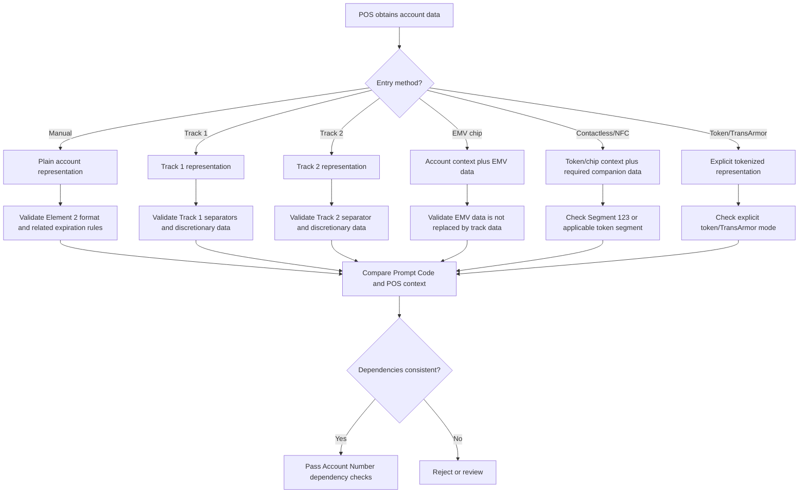

# Account Number Entry Dependency Flow

```mermaid
flowchart TD
    A[POS obtains account data] --> B{Entry method?}
    B -->|Manual| C[Plain account representation]
    B -->|Track 1| D[Track 1 representation]
    B -->|Track 2| E[Track 2 representation]
    B -->|EMV chip| F[Account context plus EMV data]
    B -->|Contactless/NFC| G[Token/chip context plus required companion data]
    B -->|Token/TransArmor| H[Explicit tokenized representation]

    C --> I[Validate Element 2 format and related expiration rules]
    D --> J[Validate Track 1 separators and discretionary data]
    E --> K[Validate Track 2 separator and discretionary data]
    F --> L[Validate EMV data is not replaced by track data]
    G --> M[Check Segment 123 or applicable token segment]
    H --> N[Check explicit token/TransArmor mode]

    I --> O[Compare Prompt Code and POS context]
    J --> O
    K --> O
    L --> O
    M --> O
    N --> O

    O --> P{Dependencies consistent?}
    P -->|Yes| Q[Pass Account Number dependency checks]
    P -->|No| R[Reject or review]
```

The key point is that Element 2 is interpreted together with entry method, card context, and companion data; it is not validated as an isolated string only.
