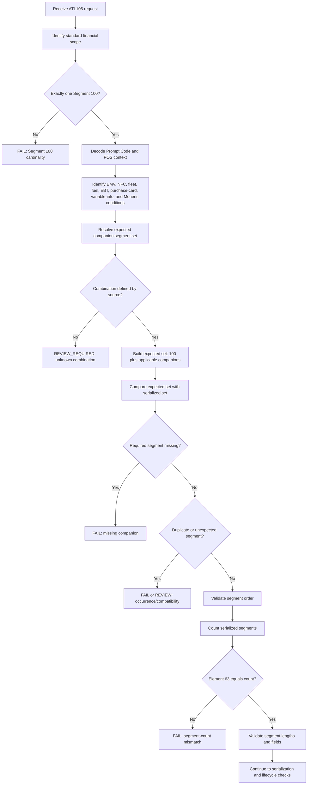

# Companion-Segment Compatibility Decision Flow



## Decision Summary

```text
Segment 100 is the baseline.
Companion segments are condition-driven.
Element 63 counts the serialized result.
Unknown combinations require review.
```
