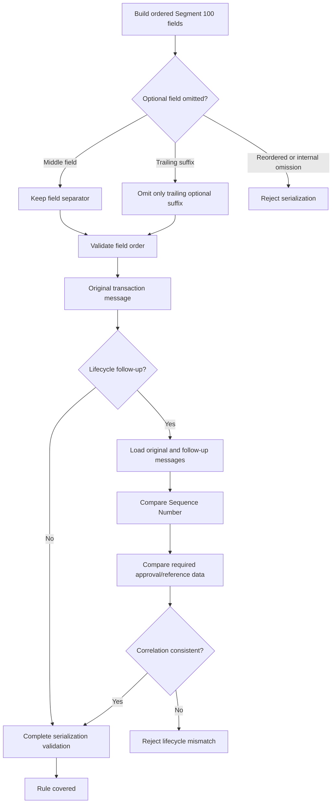

# Segment 100 Final Closure Flow

```mermaid
flowchart TD
    A[Build ordered Segment 100 fields] --> B{Optional field omitted?}
    B -->|Middle field| C[Keep field separator]
    B -->|Trailing suffix| D[Omit only trailing optional suffix]
    B -->|Reordered or internal omission| X[Reject serialization]
    C --> E[Validate field order]
    D --> E
    E --> F[Original transaction message]
    F --> G{Lifecycle follow-up?}
    G -->|No| H[Complete serialization validation]
    G -->|Yes| I[Load original and follow-up messages]
    I --> J[Compare Sequence Number]
    J --> K[Compare required approval/reference data]
    K --> L{Correlation consistent?}
    L -->|Yes| H
    L -->|No| Y[Reject lifecycle mismatch]
    H --> Z[Rule covered]
```
