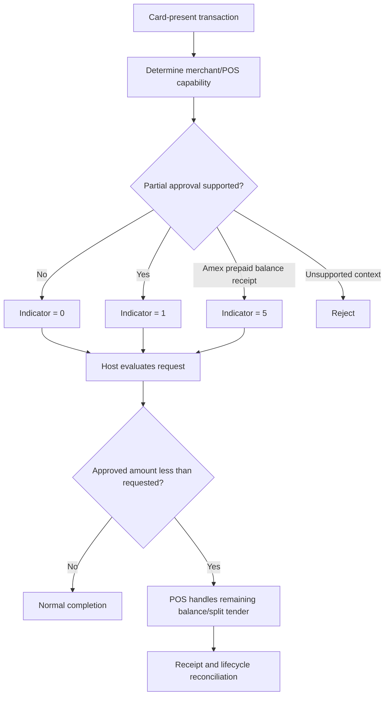

# Partial Approval Dependency Flow

The key distinction is between the **capability indicator** and the **approval result**. A partial approval indicator does not itself approve or decline the transaction.
