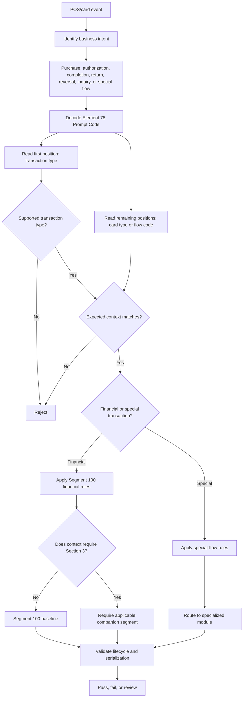

# Prompt Code Dependency Flow

## Key Insight

Prompt Code validation is a dependency check, not just a regular-expression check. A syntactically valid Prompt Code can still be business-invalid when it disagrees with the POS event, lifecycle, card type, or required companion segment.
