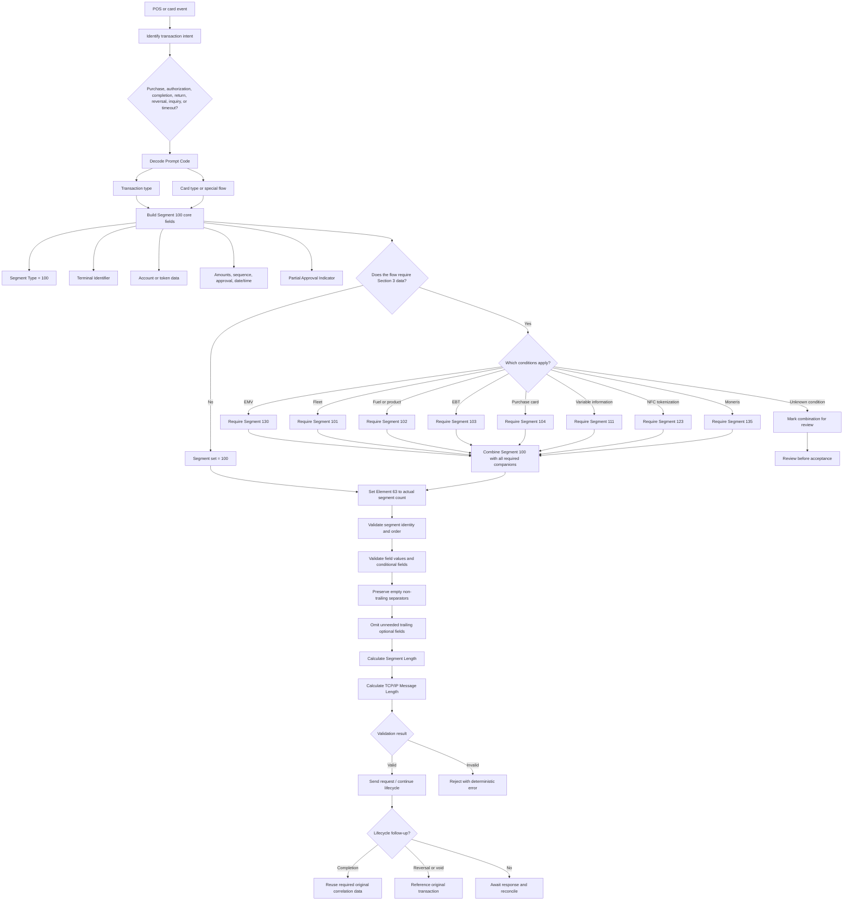

# Segment 100 End-to-End Flow

This diagram shows the business and technical decision path for a standard ATL105 Financial Transaction Request.

## How to Read the Flow

- The left side is POS/card business analysis.
- The middle is message construction.
- The right side is serialization, validation, and lifecycle behavior.
- The `Unknown condition` path is intentionally not an automatic pass or fail; it requires specification or business review.
- Element 63 counts the final segment set, not merely the number of business conditions.
