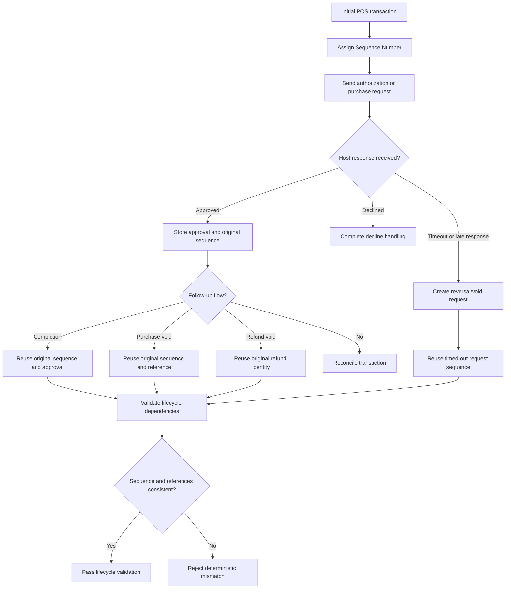

# Sequence and Lifecycle Correlation Flow

## Key Principle

A new Sequence Number for a follow-up message usually means the POS has lost the identity of the original transaction. That is a lifecycle defect even when the individual message fields look valid.
