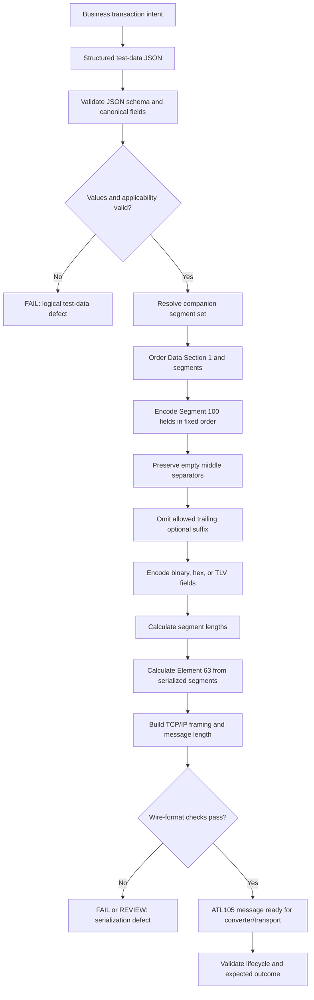

# Segment 100 Serialization and Wire-Format Flow



## Layered Decision

```text
Business meaning
  -> logical JSON
  -> serialized Segment 100
  -> complete ATL105 payload
  -> TCP/IP frame
  -> executable test input
```

A failure at any layer must identify the representation, field/segment, rule, and source anchor involved.
