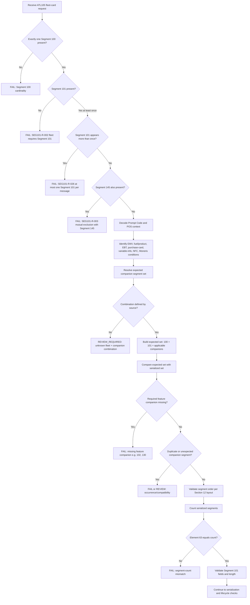

# Segment 101 Companion-Segment Compatibility Decision Flow



## Decision Summary

```text
Segment 100 is the baseline for every ATL105 request.
Segment 101 is required for every fleet-card financial transaction.
Segment 145 is mutually exclusive with Segment 101.
Feature companions are condition-driven (102, 130, 103, 104, 111, 123, 135).
Element 63 counts the serialized result.
Unknown combinations require review.
```
