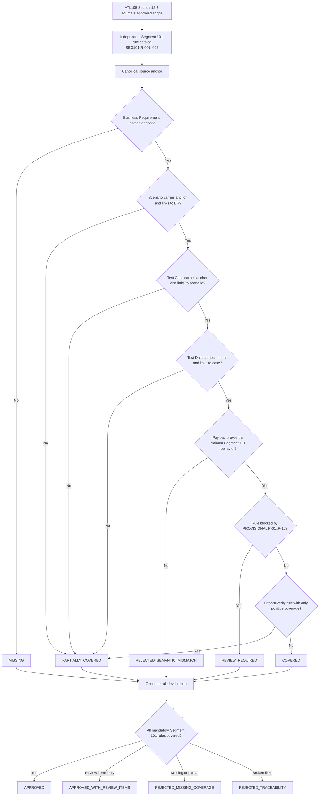

# Segment 101 Coverage Closure Flow

## Human Checkpoints

### Checkpoint 1: Scope approval

The SME/TBA confirms which Segment 101 rules belong in this release (base fields, Fleet Tags, companion compatibility, lifecycle).

### Checkpoint 2: Rule catalog approval

The Test Team confirms that each of the 26 `SEG101-R-###` catalog rows is atomic, sourced (Section 12.2 + element + rule), and testable.

### Checkpoint 3: Artifact mapping approval

The Test Team confirms that source anchors are semantically equivalent even when local IDs differ (the AI producer uses `REQ-SRC-ATL105-PDF-001:###` etc.).

### Checkpoint 4: Semantic evidence approval

The SME/TBA confirms that the payload actually represents the intended fleet-card behavior — e.g., that a "Segment 101 + Segment 145 both present" test data truly encodes both segments simultaneously.

### Checkpoint 5: PROVISIONAL resolution

For every rule flagged `REVIEW_REQUIRED` because of a `PROVISIONAL` item (P-01..P-10), the SME records the resolution before the rule may be re-classified.

### Checkpoint 6: Certification approval

The Test Team decides whether review items block release and records the decision with the report.

## Important Principle

A percentage such as `95% covered` is not sufficient evidence. The report must identify the exact uncovered Segment 101 rule, missing artifact, semantic mismatch, or unresolved business interpretation (PROVISIONAL question).
