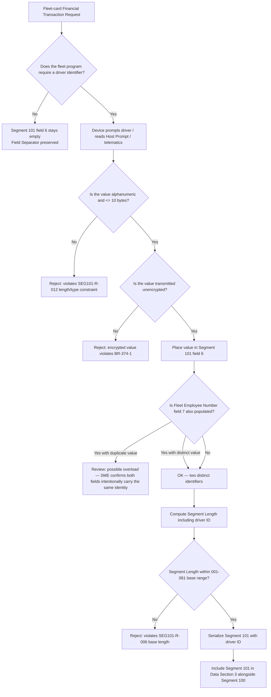

# Driver / Identification Number Dependency Flow

## Key Insight

Driver / Identification Number is a **conditional, unencrypted alphanumeric** field. A syntactically valid encrypted string is still a defect for this element. Populating both Driver ID and Fleet Employee Number with the same value is a review item — the program may intentionally duplicate or may have mis-mapped an identifier.
