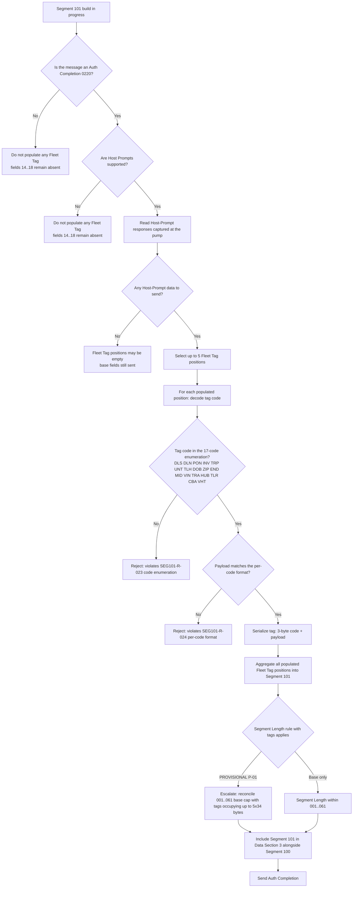

# Fleet Tag Decision Flow

## Reading The Flow

1. **Two hard gates** — Auth Completion message type **and** Host Prompts capability — must both hold before any Fleet Tag can be populated. Missing either is a hard reject.
2. **Enumeration and format** — the 3-byte code and the per-code payload format are validated independently. A valid code with an out-of-format payload is still invalid.
3. **Length reconciliation** — the base Segment Length range of 001..061 does not obviously accommodate five populated Fleet Tags of up to 34 bytes each; this is tracked as `PROVISIONAL P-01` and requires SME resolution before Item 5 mutation testing.
4. **Ordering** — the flow does not require any specific ordering of tag codes across positions 1..5; the fleet program owns the ordering decision.
