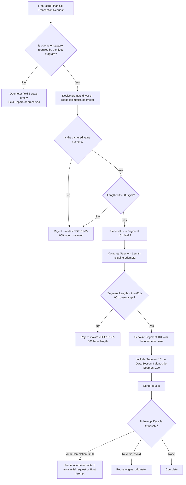

# Odometer Dependency Flow

## Key Insight

Odometer validation is a **conditional field check** driven by the fleet program, not a universal Segment 101 requirement. A missing Odometer is only a defect when the fleet program mandated it — otherwise, an empty field with a preserved separator is the correct wire representation.
