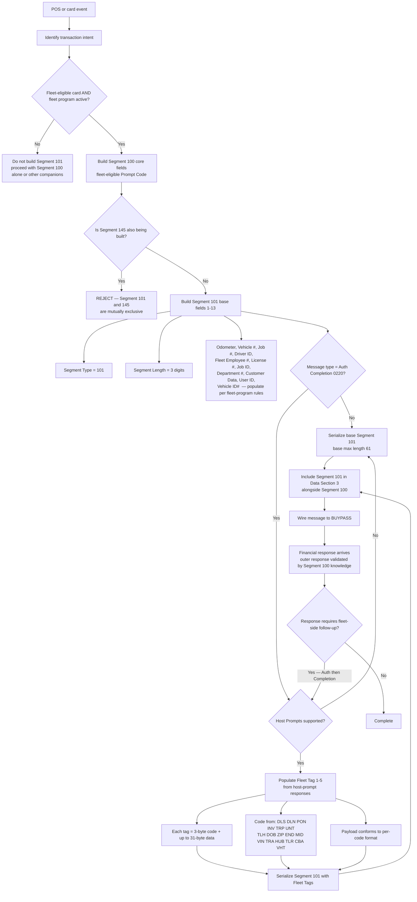

# Segment 101 End-to-End Flow

This diagram shows the business and technical decision path for Segment 101 (Fleet Data Segment) as a companion of Segment 100 in an ATL105 fleet-card financial transaction.

## Reading The Flow

1. **Eligibility gate.** The very first decision is whether the card and fleet program qualify for Segment 101. Non-fleet card types must not carry Segment 101.
2. **Mutual exclusion.** Before any Segment 101 fields are populated, the message must not already carry Segment 145 (Enhanced Fleet). A combined message is a rejection scenario.
3. **Base fields.** Fields 1–13 apply to every fleet message. Fields 3–13 are conditional; the fleet program (governed by the Petroleum Industry Processing Specifications — see PROVISIONAL P-07) determines which are mandatory.
4. **Fleet Tags branch.** Fields 14–18 (Fleet Tag 1–5) are exclusive to Auth Completion (0220) messages and require Host Prompts support. Anywhere else, the tags are absent.
5. **Serialization.** Base max length is 61 bytes (Element 84 valid values). The reconciliation with tag-carrying messages is PROVISIONAL P-01.
6. **Response side.** ATL105 does not enumerate Segment 101 in Financial Response messages; validation of response semantics is handled by Segment 100 response knowledge (see PROVISIONAL P-05).

## Related Segment 100 Decisions

The Segment 100 [end-to-end flow](../segment-100/segment-100-flow.md) shows the parent decision `Fleet? -> Require Segment 101` as the trigger for this diagram.
