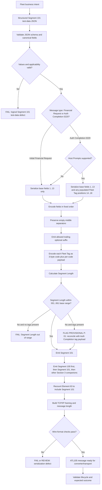

# Segment 101 Serialization and Wire-Format Flow



## Layered Decision

```text
Fleet business intent
  -> logical Segment 101 JSON
  -> serialized Segment 101 (base fields + optional Fleet Tags)
  -> complete ATL105 payload (Segment 100 + Segment 101 + other companions)
  -> TCP/IP frame
  -> executable test input
```

A failure at any layer must identify the representation, field/segment, rule, and source anchor involved.
