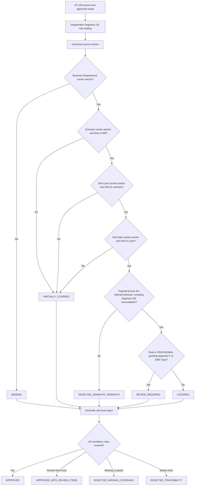

# Segment 102 Coverage Closure Flow

## Human Checkpoints

### Checkpoint 1: Scope approval

The SME/TBA confirms which Segment 102 rules belong in this release, including whether Segment 143 (Tax by Product) consistency is in scope.

### Checkpoint 2: Rule catalog approval

The Test Team confirms that each catalog row is atomic, sourced, and testable, and that `PROVISIONAL` rows are visibly tracked.

### Checkpoint 3: Artifact mapping approval

The Test Team confirms that source anchors are semantically equivalent even when local IDs differ.

### Checkpoint 4: Semantic evidence approval

The SME/TBA confirms that the payload represents real pump/POS product behavior, and that the Segment 102-to-Segment 100 amount reconciliation actually holds in the test data, not merely that both segments are present.

### Checkpoint 5: Certification approval

The Test Team decides whether review items (including open Appendix F/product-classification items) block release and records the decision with the report.

## Important Principle

A percentage such as `95% covered` is not sufficient evidence. The report must identify the exact uncovered rule, missing artifact, semantic mismatch, or unresolved business interpretation.
