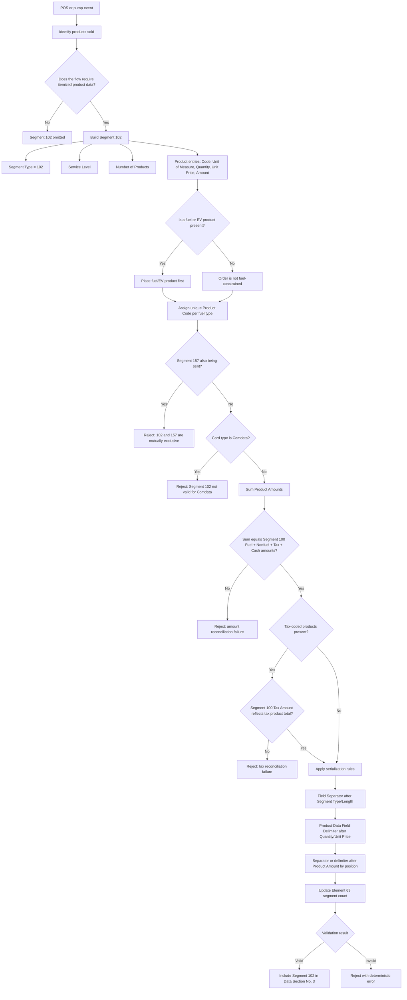

# Segment 102 End-to-End Flow

This diagram shows the business and technical decision path for building and validating the Product Code Data Segment within an ATL105 Financial Transaction Request.

## How to Read the Flow

- The left side is POS/pump business analysis: what was sold and how.
- The middle is per-product message construction and ordering rules.
- The right side is cross-segment reconciliation, serialization, and validation outcome.
- Amount reconciliation against Segment 100 is the step most likely to be silently skipped by an AI-generated artifact; treat it as a first-class validation gate, not an optional check.
