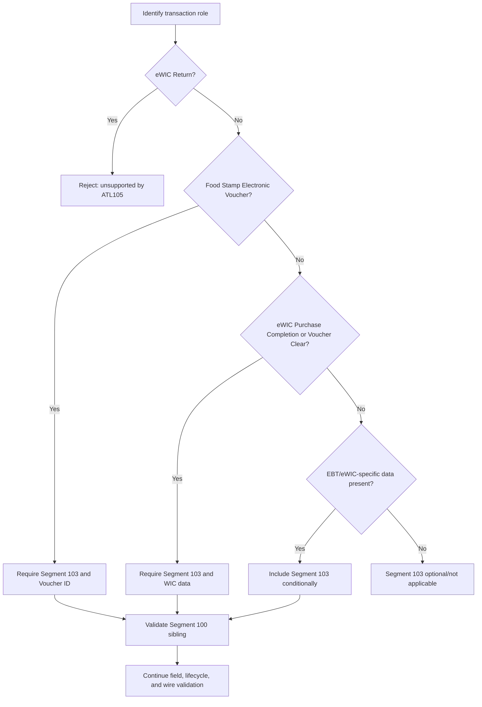

# Segment 103 Applicability Decision Flow

```mermaid
flowchart TD
    A[Identify transaction role] --> B{eWIC Return?}
    B -->|Yes| C[Reject: unsupported by ATL105]
    B -->|No| D{Food Stamp Electronic Voucher?}
    D -->|Yes| E[Require Segment 103 and Voucher ID]
    D -->|No| F{eWIC Purchase Completion or Voucher Clear?}
    F -->|Yes| G[Require Segment 103 and WIC data]
    F -->|No| H{EBT/eWIC-specific data present?}
    H -->|Yes| I[Include Segment 103 conditionally]
    H -->|No| J[Segment 103 optional/not applicable]
    E --> K[Validate Segment 100 sibling]
    G --> K
    I --> K
    K --> L[Continue field, lifecycle, and wire validation]
```

The flow is implemented by `Segment103ApplicabilityValidator`, not inferred from card type alone.
