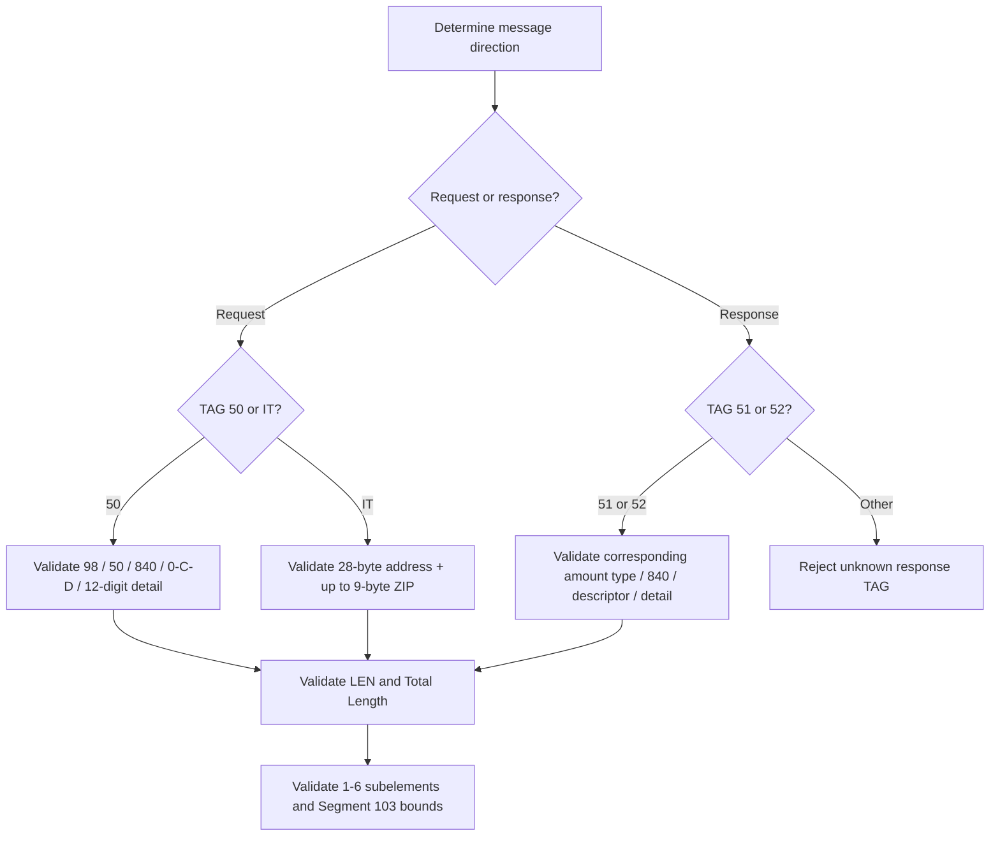

# EBT Program Data Decision Flow

```mermaid
flowchart TD
    A[Determine message direction] --> B{Request or response?}
    B -->|Request| C{TAG 50 or IT?}
    B -->|Response| D{TAG 51 or 52?}
    C -->|50| E[Validate 98 / 50 / 840 / 0-C-D / 12-digit detail]
    C -->|IT| F[Validate 28-byte address + up to 9-byte ZIP]
    D -->|51 or 52| G[Validate corresponding amount type / 840 / descriptor / detail]
    D -->|Other| H[Reject unknown response TAG]
    E --> I[Validate LEN and Total Length]
    F --> I
    G --> I
    I --> J[Validate 1-6 subelements and Segment 103 bounds]
```
