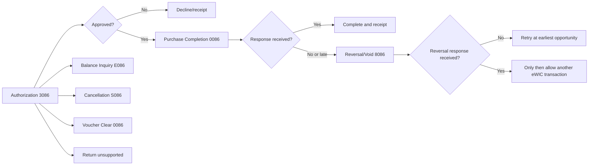

# eWIC Prompt and Lifecycle Flow

```mermaid
flowchart LR
    A[Authorization 3086] --> B{Approved?}
    B -->|No| C[Decline/receipt]
    B -->|Yes| D[Purchase Completion 0086]
    D --> E{Response received?}
    E -->|Yes| F[Complete and receipt]
    E -->|No or late| G[Reversal/Void 8086]
    G --> H{Reversal response received?}
    H -->|No| I[Retry at earliest opportunity]
    H -->|Yes| J[Only then allow another eWIC transaction]
    A --> K[Balance Inquiry E086]
    A --> L[Cancellation S086]
    A --> M[Voucher Clear 0086]
    A --> N[Return unsupported]
```

Each branch must carry a clear lifecycle role and the correct Segment 100 Prompt Code before Segment 103 field validation begins.
