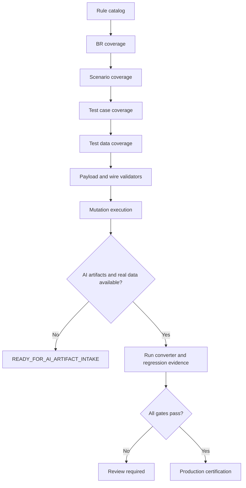

# Segment 103 Final Closure Flow

```mermaid
flowchart TD
    A[Rule catalog] --> B[BR coverage]
    B --> C[Scenario coverage]
    C --> D[Test case coverage]
    D --> E[Test data coverage]
    E --> F[Payload and wire validators]
    F --> G[Mutation execution]
    G --> H{AI artifacts and real data available?}
    H -->|No| I[READY_FOR_AI_ARTIFACT_INTAKE]
    H -->|Yes| J[Run converter and regression evidence]
    J --> K{All gates pass?}
    K -->|No| L[Review required]
    K -->|Yes| M[Production certification]
```
