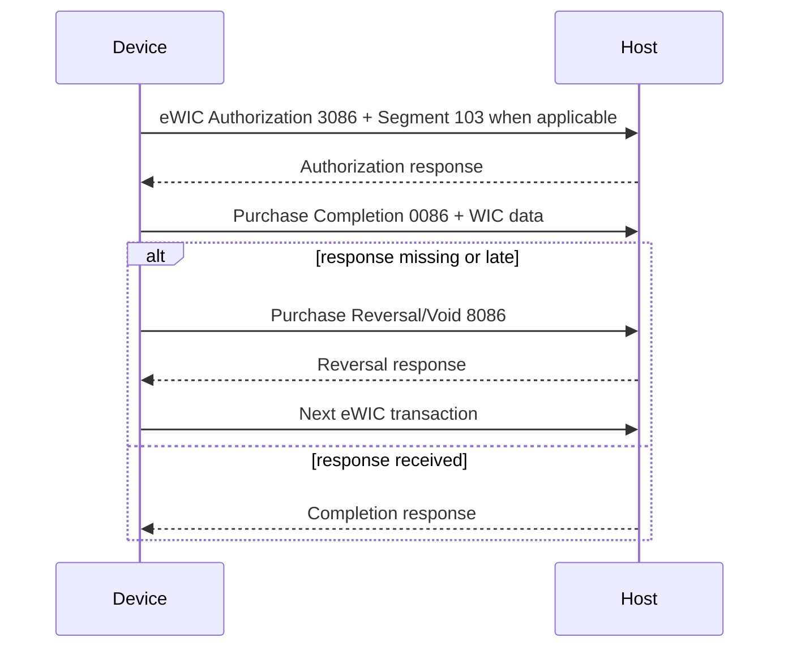

# Segment 103 Sequence and Lifecycle Flow

```mermaid
sequenceDiagram
    participant Device
    participant Host
    Device->>Host: eWIC Authorization 3086 + Segment 103 when applicable
    Host-->>Device: Authorization response
    Device->>Host: Purchase Completion 0086 + WIC data
    alt response missing or late
        Device->>Host: Purchase Reversal/Void 8086
        Host-->>Device: Reversal response
        Device->>Host: Next eWIC transaction
    else response received
        Host-->>Device: Completion response
    end
```

The device must complete the reversal path before submitting another eWIC transaction from the originating device.
