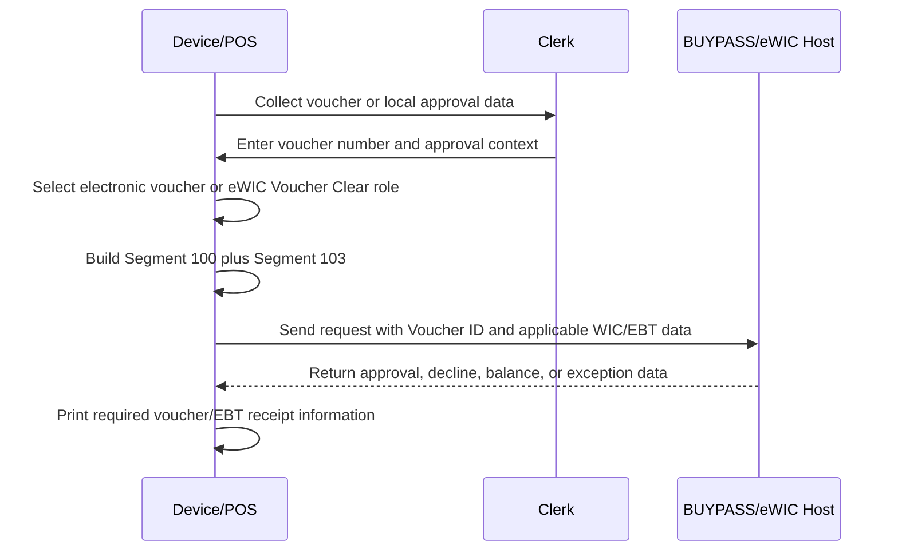

# Segment 103 Voucher Lifecycle Flow

```mermaid
sequenceDiagram
    participant POS as Device/POS
    participant Clerk as Clerk
    participant Host as BUYPASS/eWIC Host
    POS->>Clerk: Collect voucher or local approval data
    Clerk->>POS: Enter voucher number and approval context
    POS->>POS: Select electronic voucher or eWIC Voucher Clear role
    POS->>POS: Build Segment 100 plus Segment 103
    POS->>Host: Send request with Voucher ID and applicable WIC/EBT data
    Host-->>POS: Return approval, decline, balance, or exception data
    POS->>POS: Print required voucher/EBT receipt information
```

Negative paths: missing Voucher ID, invalid Voucher ID, unsupported eWIC Return, and a voucher request without the required Segment 100 sibling.
