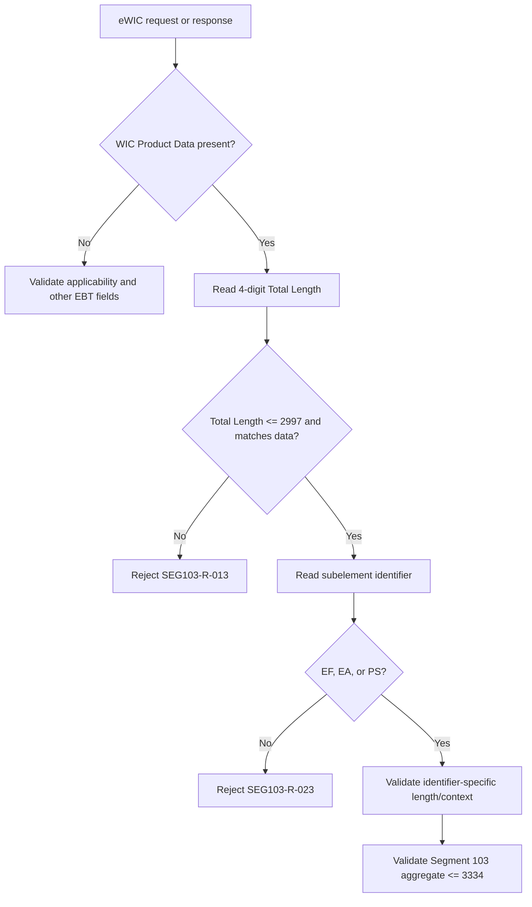

# WIC Product Data Decision Flow

```mermaid
flowchart TD
    A[eWIC request or response] --> B{WIC Product Data present?}
    B -->|No| C[Validate applicability and other EBT fields]
    B -->|Yes| D[Read 4-digit Total Length]
    D --> E{Total Length <= 2997 and matches data?}
    E -->|No| F[Reject SEG103-R-013]
    E -->|Yes| G[Read subelement identifier]
    G --> H{EF, EA, or PS?}
    H -->|No| I[Reject SEG103-R-023]
    H -->|Yes| J[Validate identifier-specific length/context]
    J --> K[Validate Segment 103 aggregate <= 3334]
```

The response context matters: EF/EA/PS have different expected eWIC lifecycle roles.
