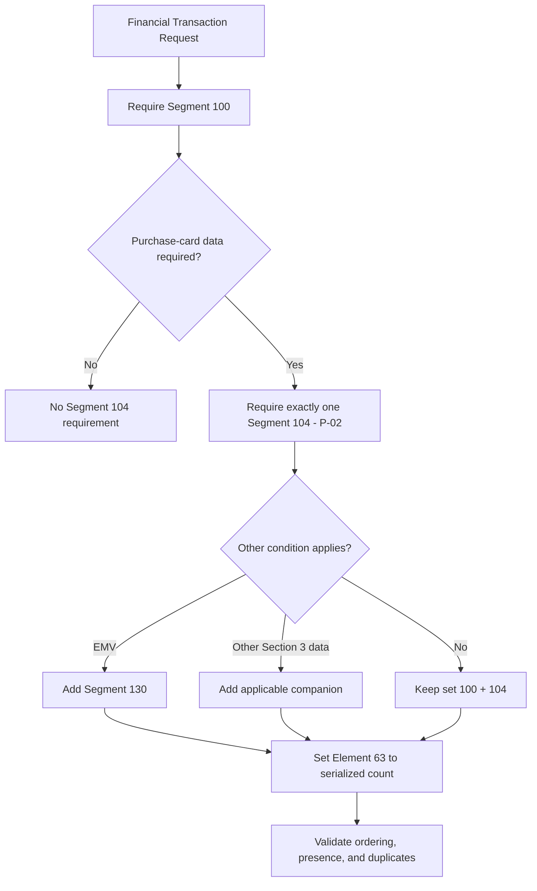

# Segment 104 Companion-Segment Compatibility Flow

```mermaid
flowchart TD
    A[Financial Transaction Request] --> B[Require Segment 100]
    B --> C{Purchase-card data required?}
    C -->|No| D[No Segment 104 requirement]
    C -->|Yes| E[Require exactly one Segment 104 - P-02]
    E --> F{Other condition applies?}
    F -->|EMV| G[Add Segment 130]
    F -->|Other Section 3 data| H[Add applicable companion]
    F -->|No| I[Keep set 100 + 104]
    G --> J[Set Element 63 to serialized count]
    H --> J
    I --> J
    J --> K[Validate ordering, presence, and duplicates]
```
