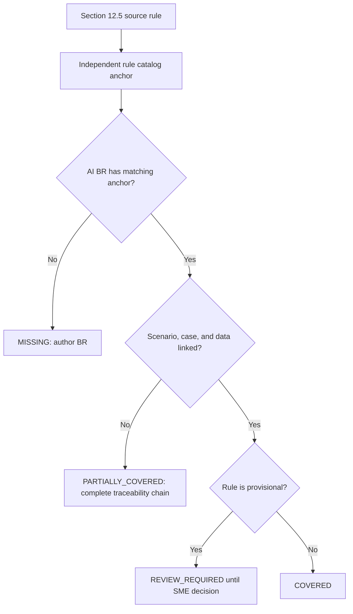

# Segment 104 Coverage Closure Flow

```mermaid
flowchart TD
    A[Section 12.5 source rule] --> B[Independent rule catalog anchor]
    B --> C{AI BR has matching anchor?}
    C -->|No| D[MISSING: author BR]
    C -->|Yes| E{Scenario, case, and data linked?}
    E -->|No| F[PARTIALLY_COVERED: complete traceability chain]
    E -->|Yes| G{Rule is provisional?}
    G -->|Yes| H[REVIEW_REQUIRED until SME decision]
    G -->|No| I[COVERED]
```
