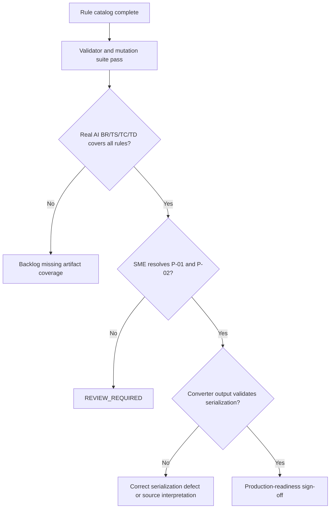

# Segment 104 Final Closure Flow

```mermaid
flowchart TD
    A[Rule catalog complete] --> B[Validator and mutation suite pass]
    B --> C{Real AI BR/TS/TC/TD covers all rules?}
    C -->|No| D[Backlog missing artifact coverage]
    C -->|Yes| E{SME resolves P-01 and P-02?}
    E -->|No| F[REVIEW_REQUIRED]
    E -->|Yes| G{Converter output validates serialization?}
    G -->|No| H[Correct serialization defect or source interpretation]
    G -->|Yes| I[Production-readiness sign-off]
```
