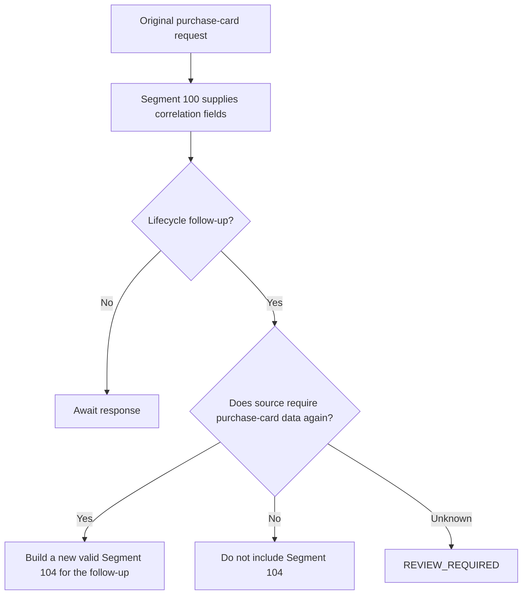

# Segment 104 Lifecycle Flow

```mermaid
flowchart TD
    A[Original purchase-card request] --> B[Segment 100 supplies correlation fields]
    B --> C{Lifecycle follow-up?}
    C -->|No| D[Await response]
    C -->|Yes| E{Does source require purchase-card data again?}
    E -->|Yes| F[Build a new valid Segment 104 for the follow-up]
    E -->|No| G[Do not include Segment 104]
    E -->|Unknown| H[REVIEW_REQUIRED]
```
