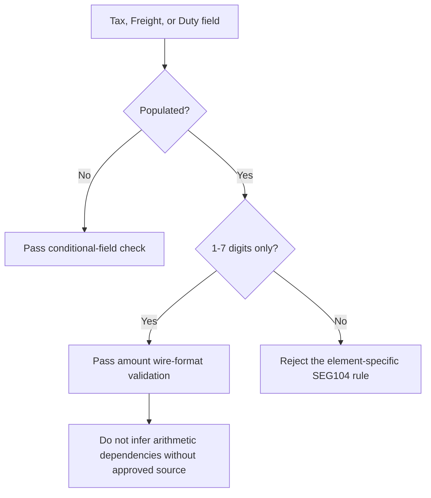

# Purchase Amounts Validation Flow

```mermaid
flowchart TD
    A[Tax, Freight, or Duty field] --> B{Populated?}
    B -->|No| C[Pass conditional-field check]
    B -->|Yes| D{1-7 digits only?}
    D -->|Yes| E[Pass amount wire-format validation]
    D -->|No| F[Reject the element-specific SEG104 rule]
    E --> G[Do not infer arithmetic dependencies without approved source]
```
