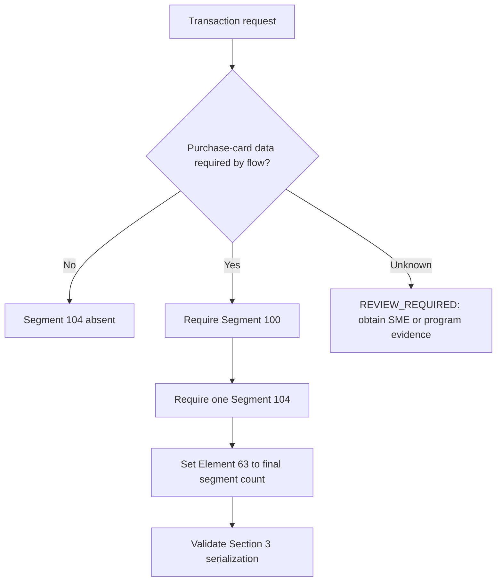

# Purchase-Card Applicability Decision Flow

```mermaid
flowchart TD
    A[Transaction request] --> B{Purchase-card data required by flow?}
    B -->|No| C[Segment 104 absent]
    B -->|Yes| D[Require Segment 100]
    D --> E[Require one Segment 104]
    E --> F[Set Element 63 to final segment count]
    F --> G[Validate Section 3 serialization]
    B -->|Unknown| H[REVIEW_REQUIRED: obtain SME or program evidence]
```
