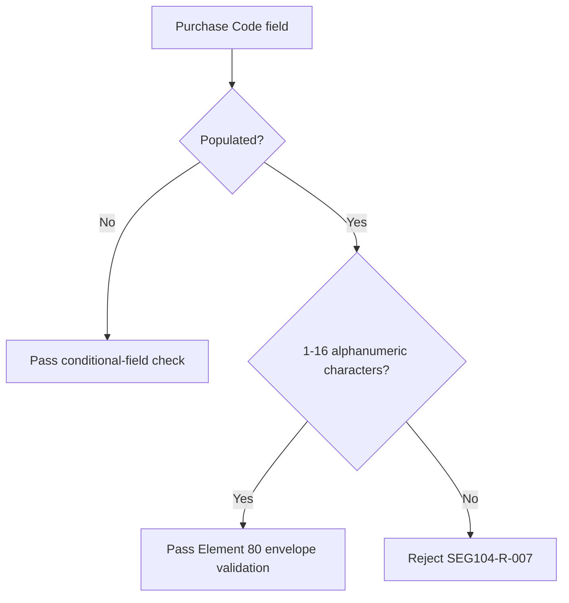

# Purchase Code Validation Flow

```mermaid
flowchart TD
    A[Purchase Code field] --> B{Populated?}
    B -->|No| C[Pass conditional-field check]
    B -->|Yes| D{1-16 alphanumeric characters?}
    D -->|Yes| E[Pass Element 80 envelope validation]
    D -->|No| F[Reject SEG104-R-007]
```
