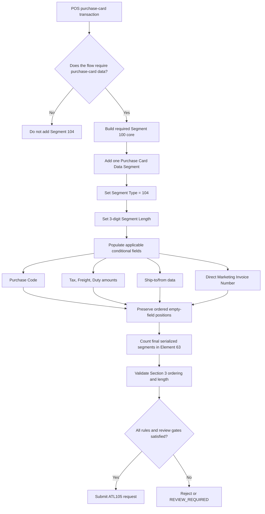

# Segment 104 End-to-End Flow

Segment 104 has no independent sequence number. Any authorization, completion, reversal, or cancellation correlation is governed by the accompanying Segment 100 and the applicable transaction-message rules.
