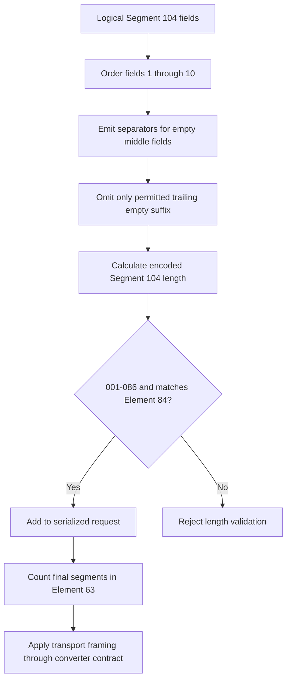

# Segment 104 Serialization and Wire-Format Flow

```mermaid
flowchart TD
    A[Logical Segment 104 fields] --> B[Order fields 1 through 10]
    B --> C[Emit separators for empty middle fields]
    C --> D[Omit only permitted trailing empty suffix]
    D --> E[Calculate encoded Segment 104 length]
    E --> F{001-086 and matches Element 84?}
    F -->|Yes| G[Add to serialized request]
    F -->|No| H[Reject length validation]
    G --> I[Count final segments in Element 63]
    I --> J[Apply transport framing through converter contract]
```
