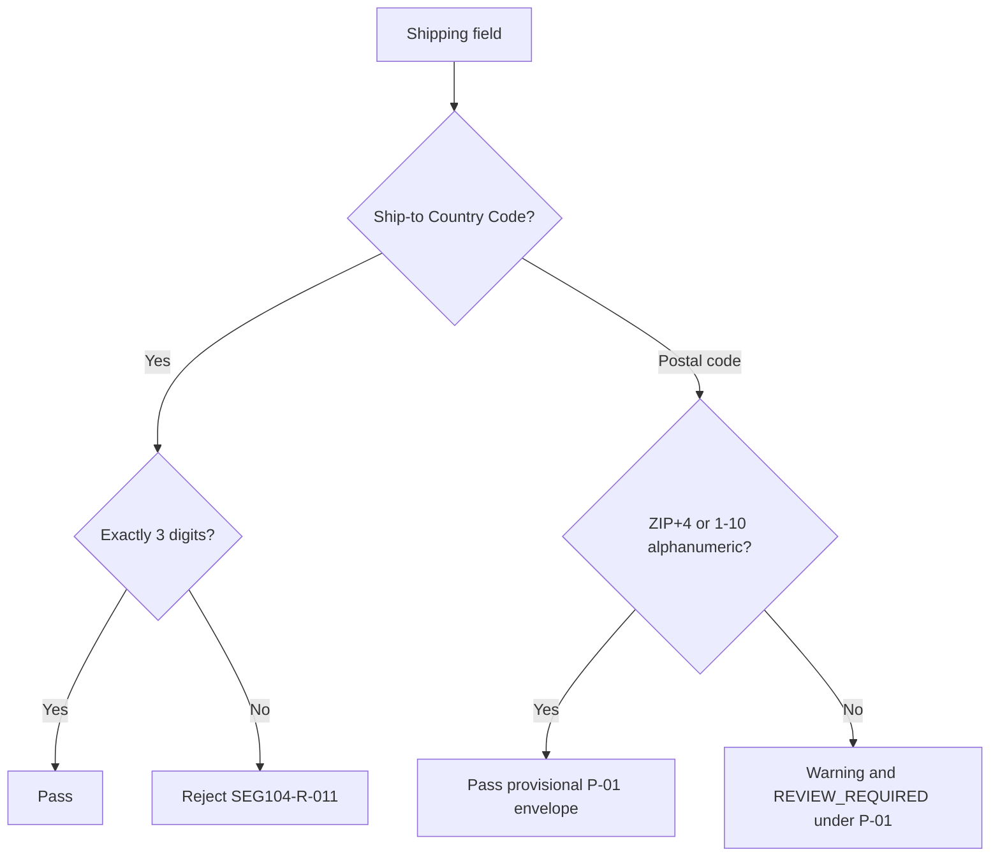

# Shipping Data Validation Flow

```mermaid
flowchart TD
    A[Shipping field] --> B{Ship-to Country Code?}
    B -->|Yes| C{Exactly 3 digits?}
    C -->|Yes| D[Pass]
    C -->|No| E[Reject SEG104-R-011]
    B -->|Postal code| F{ZIP+4 or 1-10 alphanumeric?}
    F -->|Yes| G[Pass provisional P-01 envelope]
    F -->|No| H[Warning and REVIEW_REQUIRED under P-01]
```
