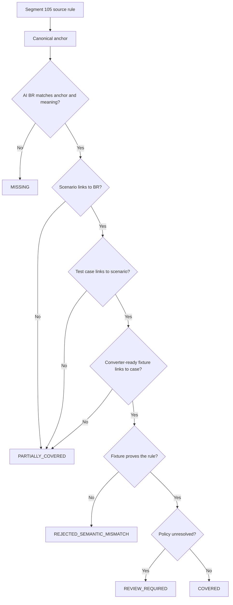

# Segment 105 Coverage Closure Flow

```mermaid
flowchart TD
    A[Segment 105 source rule] --> B[Canonical anchor]
    B --> C{AI BR matches anchor and meaning?}
    C -->|No| M[MISSING]
    C -->|Yes| D{Scenario links to BR?}
    D -->|No| P[PARTIALLY_COVERED]
    D -->|Yes| E{Test case links to scenario?}
    E -->|No| P
    E -->|Yes| F{Converter-ready fixture links to case?}
    F -->|No| P
    F -->|Yes| G{Fixture proves the rule?}
    G -->|No| S[REJECTED_SEMANTIC_MISMATCH]
    G -->|Yes| H{Policy unresolved?}
    H -->|Yes| R[REVIEW_REQUIRED]
    H -->|No| I[COVERED]
```