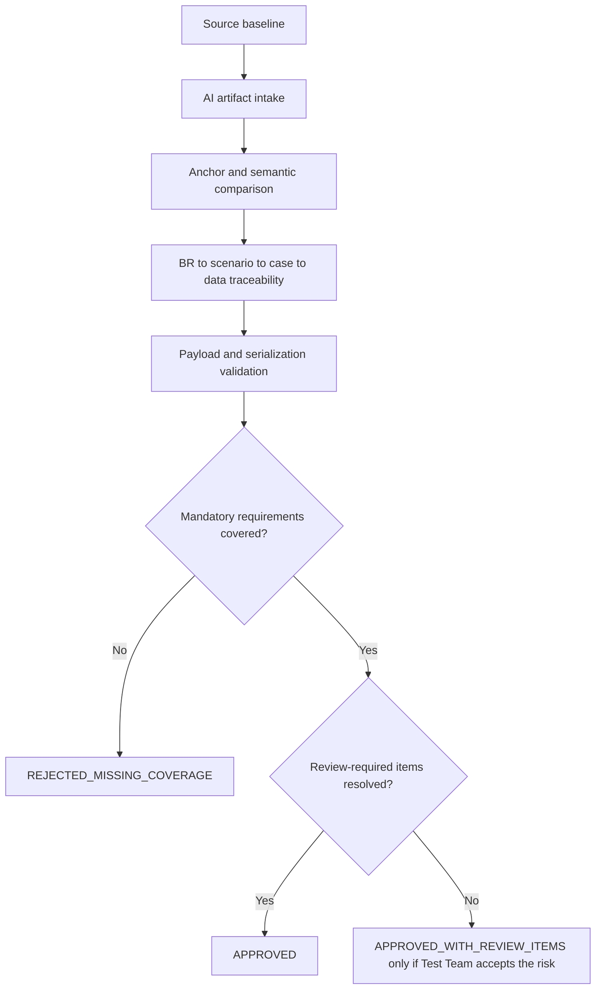

# Segment 105 Final Closure Flow

```mermaid
flowchart TD
    A[Source baseline] --> B[AI artifact intake]
    B --> C[Anchor and semantic comparison]
    C --> D[BR to scenario to case to data traceability]
    D --> E[Payload and serialization validation]
    E --> F{Mandatory requirements covered?}
    F -->|No| G[REJECTED_MISSING_COVERAGE]
    F -->|Yes| H{Review-required items resolved?}
    H -->|Yes| I[APPROVED]
    H -->|No| J[APPROVED_WITH_REVIEW_ITEMS only if Test Team accepts the risk]
```