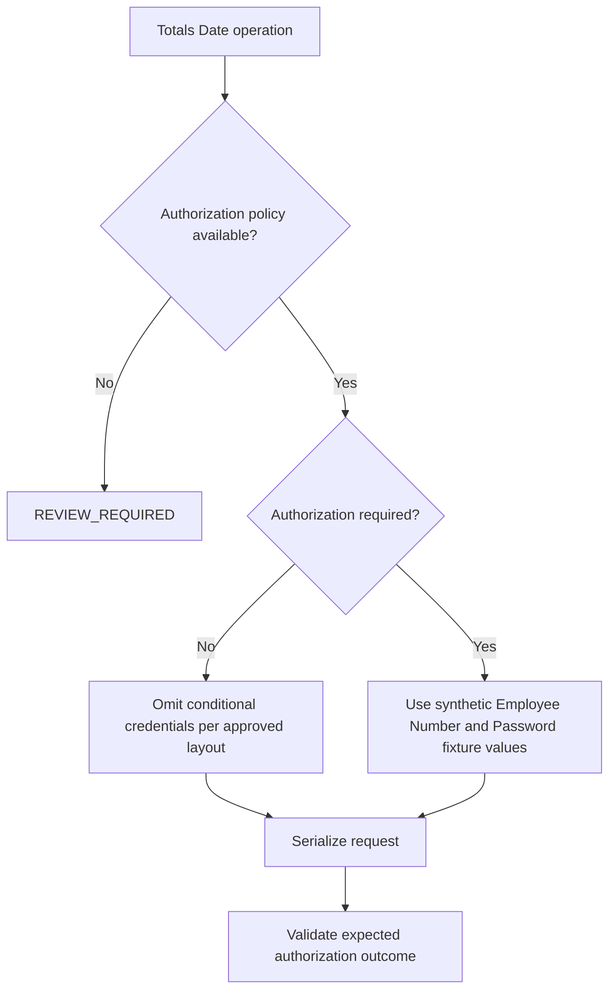

# Segment 105 Operator Authorization Flow

```mermaid
flowchart TD
    A[Totals Date operation] --> B{Authorization policy available?}
    B -->|No| R[REVIEW_REQUIRED]
    B -->|Yes| C{Authorization required?}
    C -->|No| D[Omit conditional credentials per approved layout]
    C -->|Yes| E[Use synthetic Employee Number and Password fixture values]
    D --> F[Serialize request]
    E --> F
    F --> G[Validate expected authorization outcome]
```