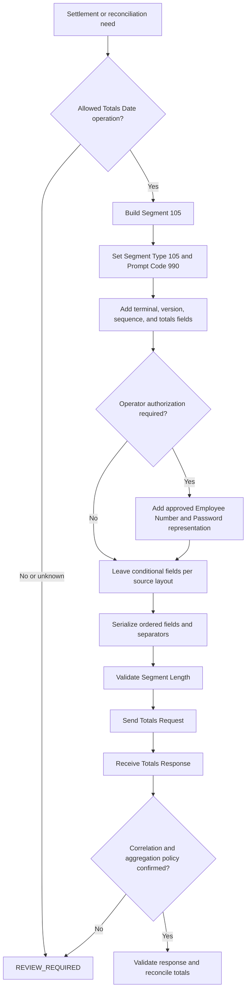

# Segment 105 End-to-End Flow

```mermaid
flowchart TD
    A[Settlement or reconciliation need] --> B{Allowed Totals Date operation?}
    B -->|No or unknown| R[REVIEW_REQUIRED]
    B -->|Yes| C[Build Segment 105]
    C --> D[Set Segment Type 105 and Prompt Code 990]
    D --> E[Add terminal, version, sequence, and totals fields]
    E --> F{Operator authorization required?}
    F -->|Yes| G[Add approved Employee Number and Password representation]
    F -->|No| H[Leave conditional fields per source layout]
    G --> H
    H --> I[Serialize ordered fields and separators]
    I --> J[Validate Segment Length]
    J --> K[Send Totals Request]
    K --> L[Receive Totals Response]
    L --> M{Correlation and aggregation policy confirmed?}
    M -->|No| R
    M -->|Yes| N[Validate response and reconcile totals]
```

The review path must not be auto-approved or auto-rejected.