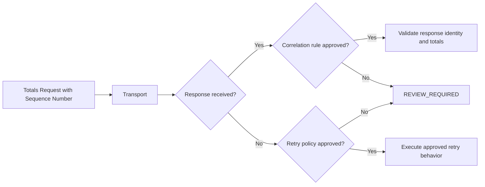

# Segment 105 Request-Response Lifecycle Flow

```mermaid
flowchart LR
    A[Totals Request with Sequence Number] --> B[Transport]
    B --> C{Response received?}
    C -->|Yes| D{Correlation rule approved?}
    D -->|Yes| E[Validate response identity and totals]
    D -->|No| R[REVIEW_REQUIRED]
    C -->|No| F{Retry policy approved?}
    F -->|Yes| G[Execute approved retry behavior]
    F -->|No| R
```