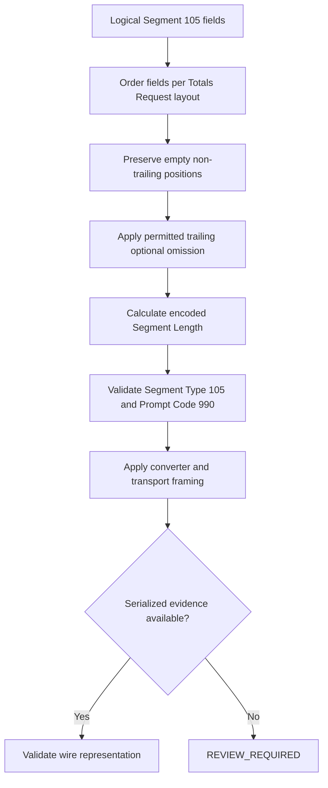

# Segment 105 Serialization and Wire-Format Flow

```mermaid
flowchart TD
    A[Logical Segment 105 fields] --> B[Order fields per Totals Request layout]
    B --> C[Preserve empty non-trailing positions]
    C --> D[Apply permitted trailing optional omission]
    D --> E[Calculate encoded Segment Length]
    E --> F[Validate Segment Type 105 and Prompt Code 990]
    F --> G[Apply converter and transport framing]
    G --> H{Serialized evidence available?}
    H -->|Yes| I[Validate wire representation]
    H -->|No| J[REVIEW_REQUIRED]
```