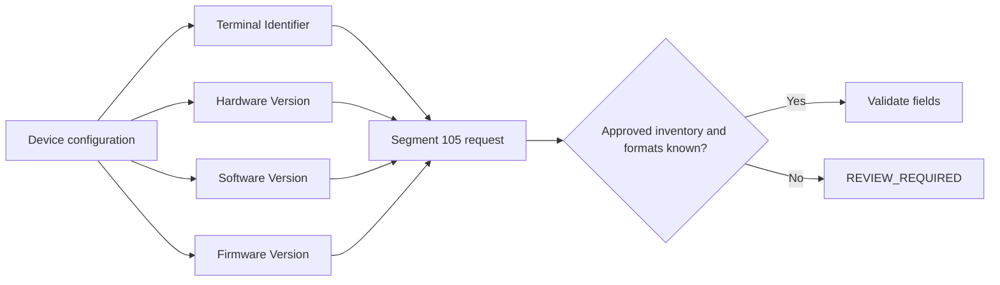

# Segment 105 Terminal and Device Version Flow

```mermaid
flowchart LR
    A[Device configuration] --> B[Terminal Identifier]
    A --> C[Hardware Version]
    A --> D[Software Version]
    A --> E[Firmware Version]
    B --> F[Segment 105 request]
    C --> F
    D --> F
    E --> F
    F --> G{Approved inventory and formats known?}
    G -->|Yes| H[Validate fields]
    G -->|No| I[REVIEW_REQUIRED]
```