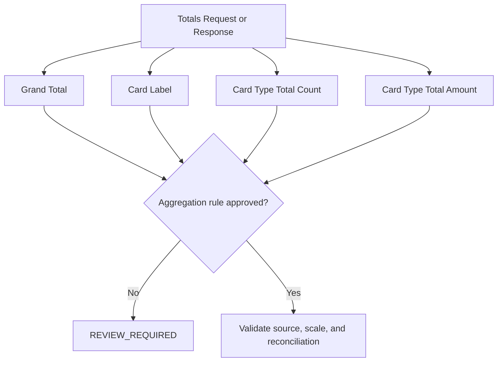

# Segment 105 Totals Aggregation Flow

```mermaid
flowchart TD
    A[Totals Request or Response] --> B[Grand Total]
    A --> C[Card Label]
    A --> D[Card Type Total Count]
    A --> E[Card Type Total Amount]
    B --> F{Aggregation rule approved?}
    C --> F
    D --> F
    E --> F
    F -->|No| R[REVIEW_REQUIRED]
    F -->|Yes| G[Validate source, scale, and reconciliation]
```