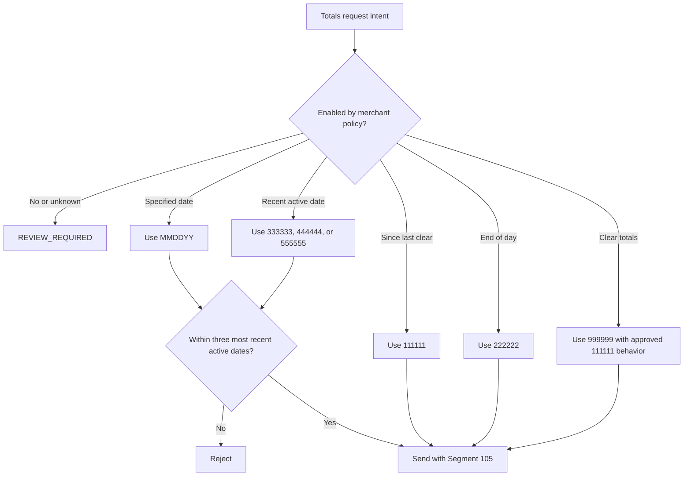

# Segment 105 Totals Date Decision Flow

```mermaid
flowchart TD
    A[Totals request intent] --> B{Enabled by merchant policy?}
    B -->|No or unknown| X[REVIEW_REQUIRED]
    B -->|Specified date| C[Use MMDDYY]
    B -->|Since last clear| D[Use 111111]
    B -->|End of day| E[Use 222222]
    B -->|Recent active date| F[Use 333333, 444444, or 555555]
    B -->|Clear totals| G[Use 999999 with approved 111111 behavior]
    C --> H{Within three most recent active dates?}
    F --> H
    H -->|No| I[Reject]
    H -->|Yes| J[Send with Segment 105]
    D --> J
    E --> J
    G --> J
```