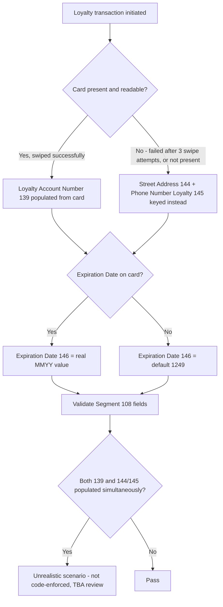

## Key Insight

Segment 108's account-identity substitution (139 vs. 144+145) is a genuine either/or business condition, not a validator-enforced exclusivity rule. Expiration Date (146) is the one field in this flow that IS code-enforced (MMYY format), following the 2026-09-22 SME resolution that reversed the earlier "reserved for future use" treatment.
