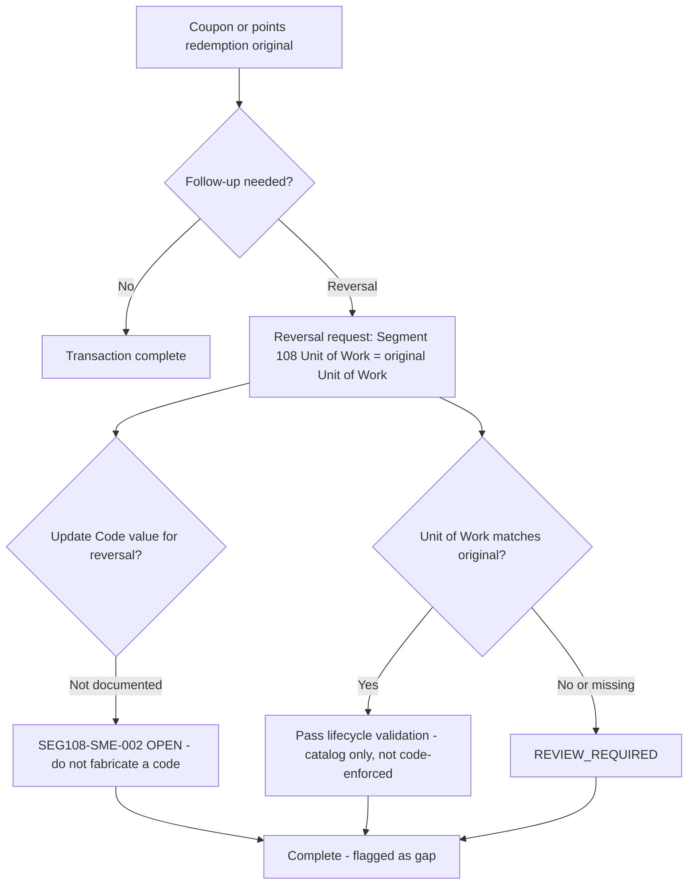

## Key Principle

For Segment 108, the reversal-to-original correlation identifier is Unit of Work (Element 151), not Segment 100's Sequence Number alone. The Update Code value that would identify a reversal request is genuinely undocumented (`SEG108-SME-002`) — treat this as an open gap, not a solved problem.
