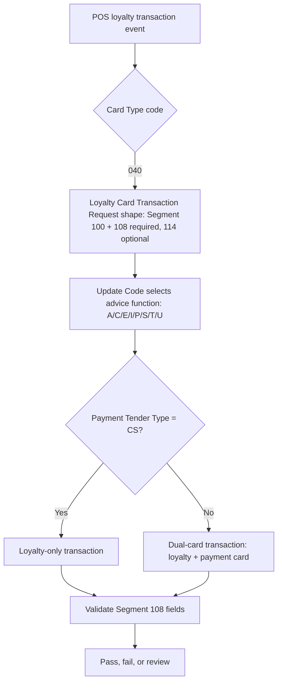

## What the Flow Teaches

- Card Type `040` is the single, unambiguous trigger for the Loyalty Card Transaction Request message family (unlike Segment 113's three related check codes).
- Payment Tender Type distinguishes loyalty-only from dual-card transactions independently of Card Type.
- A negative test should change the Card Type independently from Segment 108's presence/absence to isolate which condition is actually being tested.
