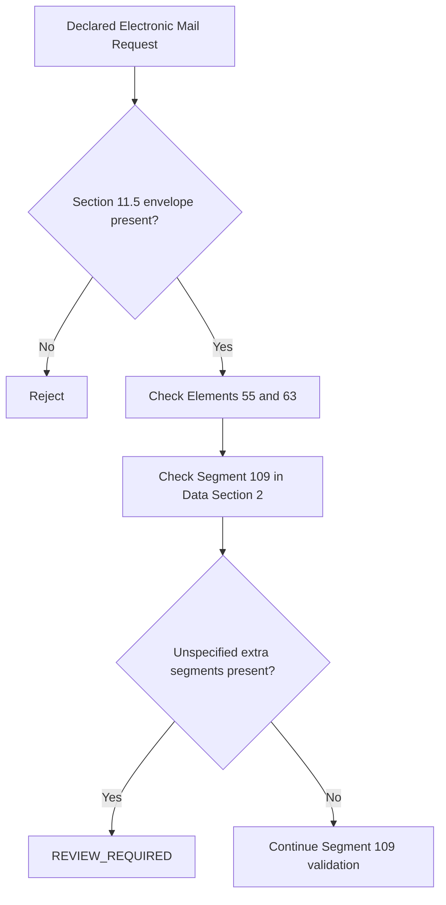

# Segment 109 Companion and Envelope Compatibility Flow

```mermaid
flowchart TD
    A[Declared Electronic Mail Request] --> B{Section 11.5 envelope present?}
    B -->|No| C[Reject]
    B -->|Yes| D[Check Elements 55 and 63]
    D --> E[Check Segment 109 in Data Section 2]
    E --> F{Unspecified extra segments present?}
    F -->|Yes| G[REVIEW_REQUIRED]
    F -->|No| H[Continue Segment 109 validation]
```