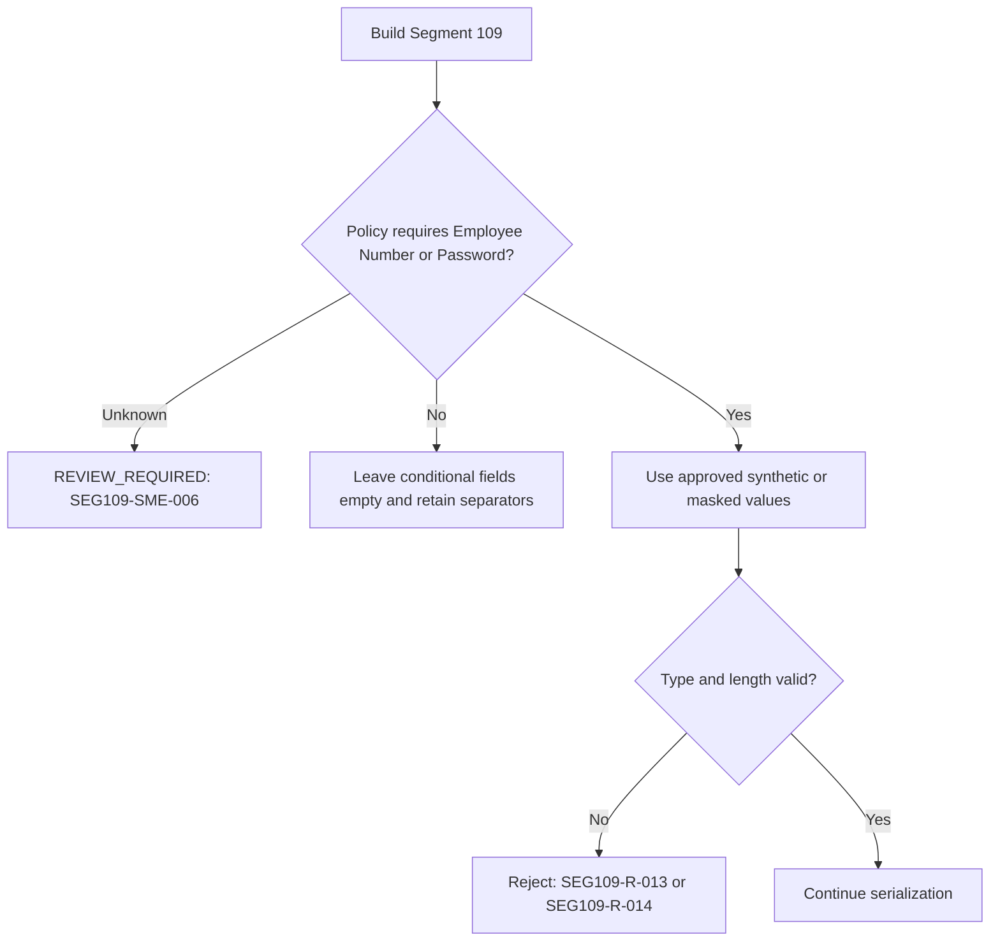

# Conditional Authorization Fields Flow

```mermaid
flowchart TD
    A[Build Segment 109] --> B{Policy requires Employee Number or Password?}
    B -->|Unknown| C[REVIEW_REQUIRED: SEG109-SME-006]
    B -->|No| D[Leave conditional fields empty and retain separators]
    B -->|Yes| E[Use approved synthetic or masked values]
    E --> F{Type and length valid?}
    F -->|No| G[Reject: SEG109-R-013 or SEG109-R-014]
    F -->|Yes| H[Continue serialization]
```