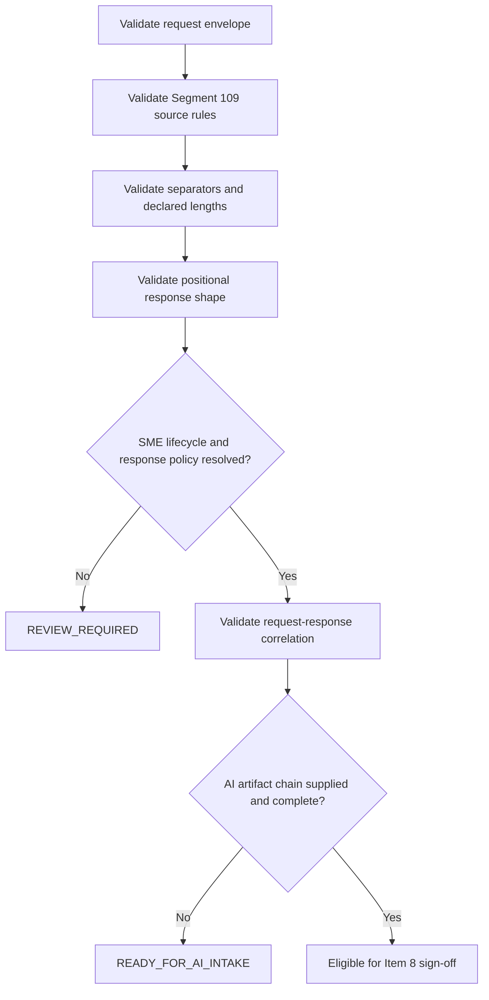

# Segment 109 Final Closure Flow

```mermaid
flowchart TD
    A[Validate request envelope] --> B[Validate Segment 109 source rules]
    B --> C[Validate separators and declared lengths]
    C --> D[Validate positional response shape]
    D --> E{SME lifecycle and response policy resolved?}
    E -->|No| F[REVIEW_REQUIRED]
    E -->|Yes| G[Validate request-response correlation]
    G --> H{AI artifact chain supplied and complete?}
    H -->|No| I[READY_FOR_AI_INTAKE]
    H -->|Yes| J[Eligible for Item 8 sign-off]
```