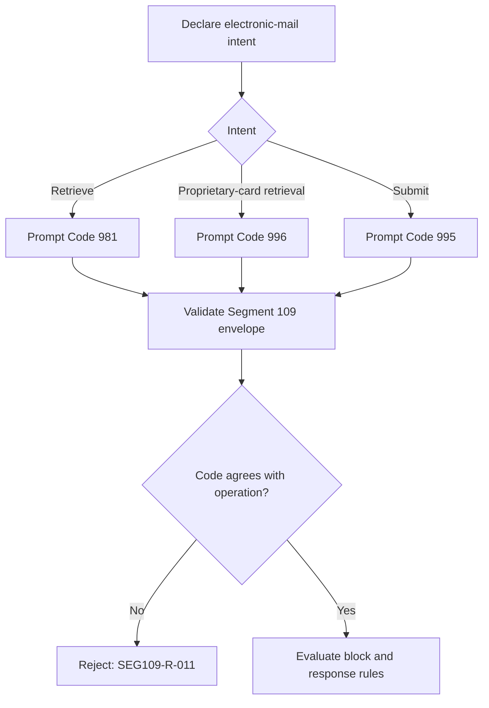

# Prompt Code Decision Flow

```mermaid
flowchart TD
    A[Declare electronic-mail intent] --> B{Intent}
    B -->|Retrieve| C[Prompt Code 981]
    B -->|Proprietary-card retrieval| D[Prompt Code 996]
    B -->|Submit| E[Prompt Code 995]
    C --> F[Validate Segment 109 envelope]
    D --> F
    E --> F
    F --> G{Code agrees with operation?}
    G -->|No| H[Reject: SEG109-R-011]
    G -->|Yes| I[Evaluate block and response rules]
```